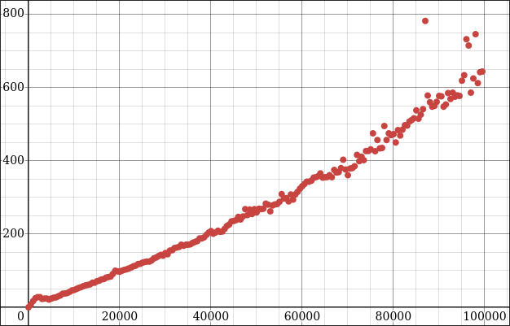
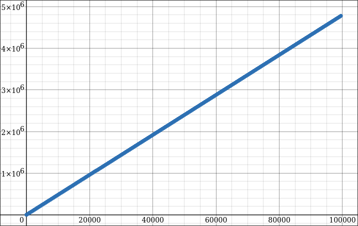
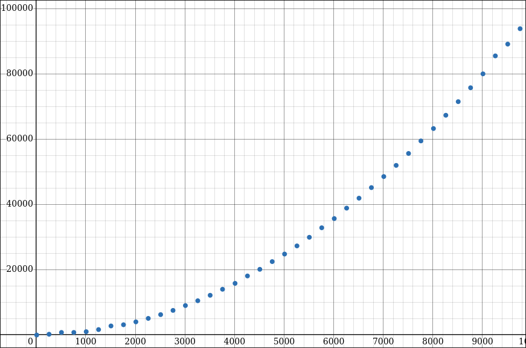

# RTProfiler - Rouviks Tiny Profiler Library
A simple header only performance measurement library for easy low effort benchmarks.

# Usage:
Just include rtprofiler.h in your main C file with RTBENCH_IMPLEMENTATION defined in a single translation unit (refer examples)
and get going!

# Explanation:
The profiler works by creating a testbench using the BENCH(...) macro [see examples/basic_bench.c](./examples/basic_bench.c) and then run our code to test within
measurements (MEASURE_T) or attach probes to the code (BENCH_HEAP_RST, BENCH_HEAP_MSR, BENCH_STACK_RST, BENCH_STACK_MSR) to get the performance readings off of
the code in question.
I would highly recommend going through all the [examples/](./examples/) to better understand the profiler, its quite simple!

# Docs:
You can find documentation for this header in: [https://rouvik.github.io/rtprofiler.h/](https://rouvik.github.io/rtprofiler.h/)

# Examples:
You can find example snippets in the `examples/` directory.

# Some tests I did:
## Factorial recursive implementation:
```c
int fact(int n)
{
    return n == 1 ? 1 : n * fact(n - 1);
}
```
### Time:


### Stack:


## Bubble Sort:
```c
void bsort(int *arr, int n)
{
    int i, j, t;
    for (i = 0; i < n - 1; i++)
    {
        for (j = 0; j < n - i - 1; j++)
        {
            if (arr[j] < arr[j + 1])
            {
                t = arr[j];
                arr[j] = arr[j + 1];
                arr[j + 1] = t;
            }
        }
    }
}
```
### Time:


> Values plotted in desmos